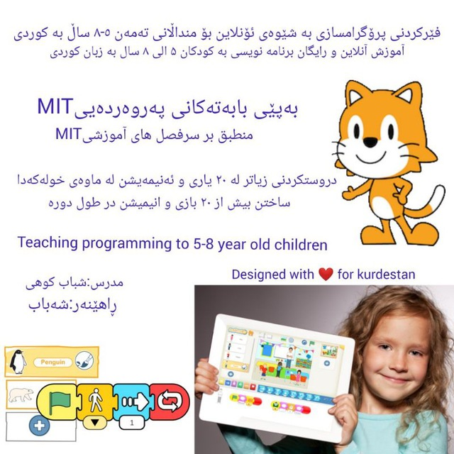

# Free programming training for children 5-8 years old in Kurdish

# Table of conntent: (title and youtube link) 

کوردی|فارسی 
 
ڕاهێنانی بەرنامەسازی ئۆنلاین و بێبەرامبەر بۆ منداڵانی تەمەن ٥-٨ ساڵ لە یوتیوب

آموزش آنلاین و رایگان برنامه نویسی به کودکان ۵ الی ۸سال بر بستر یوتیوب

Free programming training for children 5-8 years old.

1- پێناسەکردنی زمانەکانی پرۆگرامسازی و ناساندنی scratch junior 
 

1-تعریف زبان های برنامه نویسی و معرفی اسکرچ جونیور scratch junior 

https://youtu.be/RAQAuHmpafo

2- دانانی Scratch Jr لەسەر مۆبایل و تابلێتەکانی ئەندرۆید
 
2-نصب اسکرچ جونیور بر روی موبایل و تبلت اندرویدی

لینکی ڤیدیۆی فێربوون:
لینک ویدیو آموزشی: 

https://youtu.be/agr97qIpm4g 

لینکی دابەزاندنی ئەپی ئەندرۆید:
 
لینک دانلود اپ اندرویدی : 

https://play.google.com/store/apps/details?id=org.scratchjr.android 

3- دانانی سکراچ جونیۆر لەسەر مۆبایل و تابلێتەکانی ئای ئۆ ئێس
 
3-نصب اسکرچ جونیور بر روی موبایل و تبلت ios 
 

لینکی ڤیدیۆی فێربوون: 
 
لینک ویدیو آموزشی: 
 

https://youtu.be/0kNMrttwEUk 

 
لینکی دابەزاندنی ئەپی ios: 
 
لینک دانلود اپ ios:  
   
https://apps.apple.com/us/app/scratchjr/id895485086 
 

4-یەکەم پرۆگرامت لە  سکراچ جونیۆر
 
4-اولین برنامه شما در اسکرچ جونیور 
 

https://youtu.be/GYI9fc3Nny4 

5-ئەنیمەیشن (سوڕانەوە)
 
5-انیمیشن (چرخش)
 

https://youtu.be/Ec5OH_A4uek

6-ئەنیمەیشن (شاردنەوە و نیشاندان)
 
6-انیمیشن (پنهان کردن و نشان دادن)
 

https://youtu.be/-sapaAQtevQ

7- دووبارەکردنەوە
 
7-تکرار
 

https://youtu.be/XxoJMJyOhnA

8- کێڵگەی ئاژەڵان
8-مزرعه حیوانات

 

https://youtu.be/wixLkRN-l98

9- تۆمارکردنی دەنگ
 
9-ضبط صدا

https://youtu.be/m-EVInxQTLk

10- لە نێوان لاپەڕەکاندا بجوڵێن
 
10-جابجایی بین صفحات

https://youtu.be/ZnOdJzOOtQA

11- گۆڕینی خێرایی
 
11-تغییر سرعت

https://youtu.be/9AsAsXg5OxQ 

12- ئەنیمەیشنی پشیلەیەک کە لە شەقامەکە دەپەڕێتەوە
 
12-انیمیشن عبور گربه از خیابان

 

https://youtu.be/XcNK7lMb0P0

13- سواربوونی ئەسپ
 
13-اسب سواری

https://youtu.be/9tEec8EZa_0

14-کارەکتەری خۆت دروست بکە
 

14-خودت کاراکترت رو بساز

 

https://youtu.be/fgKN8h_askw

15-کێ سەردەکەوێت؟ کیسەڵ یان کەروێشک؟
 

15-کی برنده میشه؟لاک پشت یا خرگوش؟

  

https://youtu.be/qZ2hCHJDf-I

16-هەڵگرتن هەشتالو 
 
16-برداشتن هلو 
 

https://youtu.be/8ZMQwhn75Vc 

17-هەڵدانی کەشتییە ئاسمانییەکان
 
17-پرتاب فضاپیما
  

https://youtu.be/ajWAi1HdOgw 

18-یاری نیشان کردن
 
18-بازی نشانه گذاری

  

https://youtu.be/wZBalwFWf8s

19- یاری پێشبینیکردن
 
19-بازی حدس زدن

  

https://youtu.be/C0flFRhsDdE

20-یاری باڵندەکە ڕزگار بکە
 
20-بازی نجات پرنده

 

https://youtu.be/MNM7d4Tx-HE

21- کەشتیوانەکە
 
21-فضانوارد

  

https://youtu.be/DYX9a8sicgQ

22- غەواس 
 
22-غواص 
 
  
 
https://youtu.be/bniTKMi-kc8 

23- قەڵاکە ڕزگار بکە 
 
23-نجات قلعه 
 
   
 
https://youtu.be/ZO03gDxIFic 
 

24- یاری باسکە 
 
24-بازی بسکتبال  
      
  
https://youtu.be/4z1FarcdGNg 

Designed with ❤️ for kurdestan...

  

